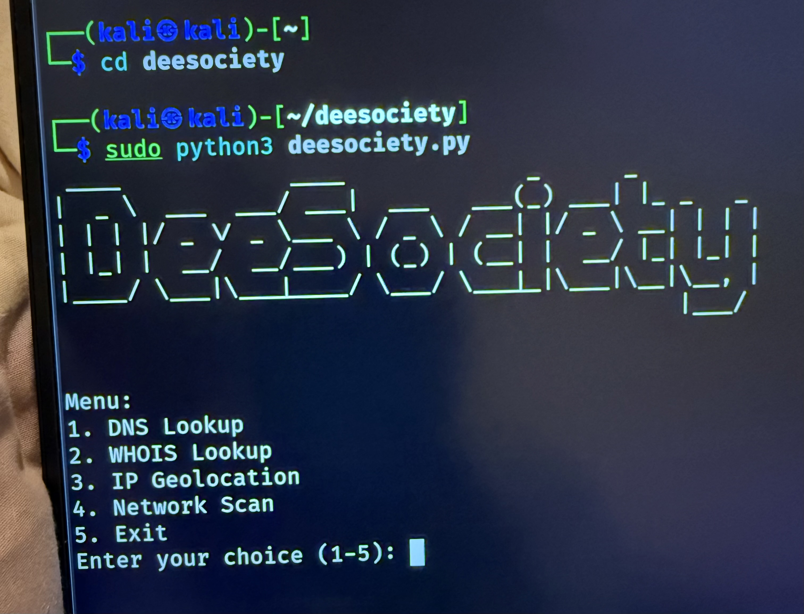
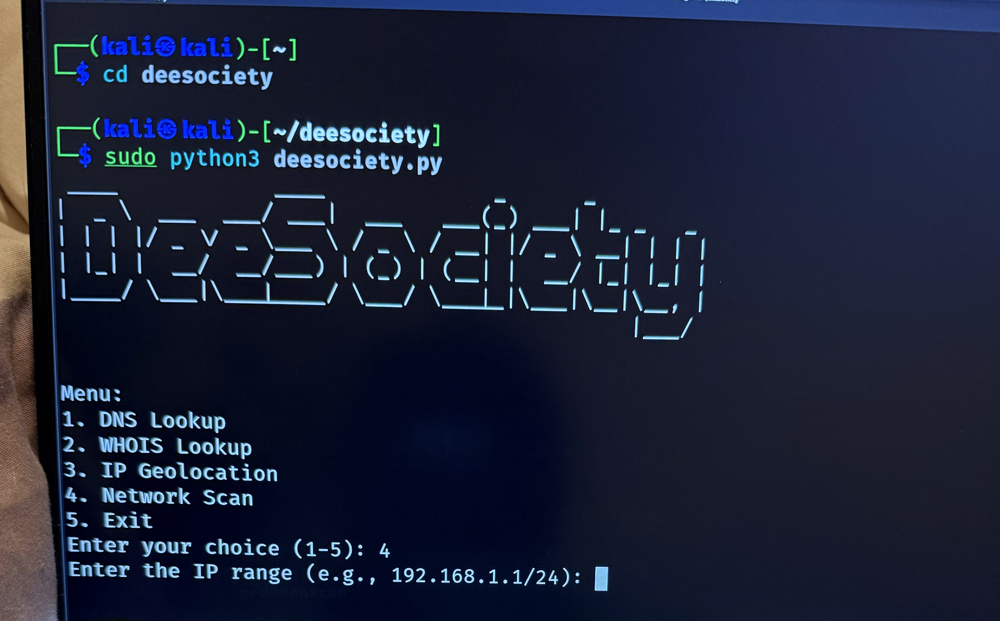
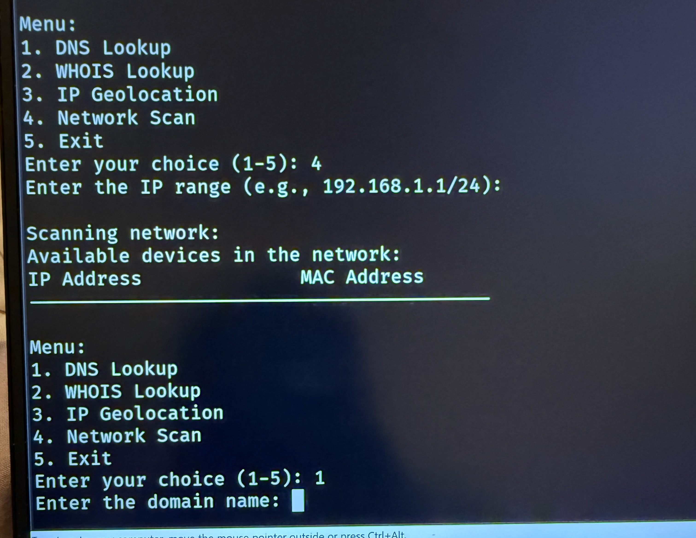

# 🛠 DeeSociety Recon Tool

**DeeSociety** is a terminal-based reconnaissance tool written in Python for DNS lookups, WHOIS data, IP geolocation, and ARP-based network scanning.

---

## 🧩 Features

- 🔍 DNS Lookup
- 🕵️ WHOIS Lookup
- 🌍 IP Geolocation
- 🌐 Local ARP Network Scan
- 🖼 Cool ASCII Banner

---

## 🐍 Installation on Kali Linux

```bash
git clone https://github.com/nungkop/deesociety.git
cd deesociety
sudo apt update
sudo apt install python3-pip -y
pip3 install -r requirements.txt
Run the Tool

sudo python3 deesociety.py

    ⚠️ sudo is required for ARP scanning (network scan feature)
📸 Screenshots
🎯 Main Menu

🌐 DNS Lookup Example

🛰️ Network Scan
## 📸 Screenshots

### 🎯 Main Menu


### 🌐 DNS Lookup


### 🛰️ Network Scan


🔗 Author

Created by @nungkop


